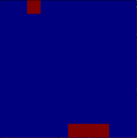
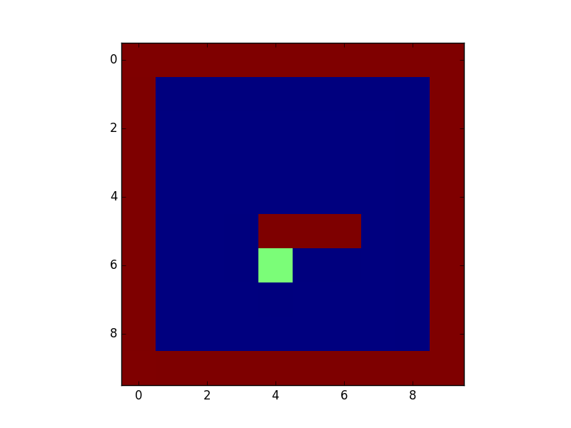

# qlearning4k
Q-learning for Keras

Qlearning4k is a reinforcement learning add-on for the python deep learning library [Keras](www.github.com/fchollet/keras). Its simple, and is ideal for rapid prototyping.

     

 **Example :**

```python
from keras.models import Sequential
from keras.layers import Dense, Flatten
from keras.optimizers import sgd
from qlearning4k.games import Catch
from qlearning4k import Agent

nb_frames = 1
grid_size = 10

model = Sequential()
model.add(Flatten(input_shape=(nb_frames, grid_size, grid_size)))
model.add(Dense(hidden_size, activation='relu'))
model.add(Dense(hidden_size, activation='relu'))
model.add(Dense(3))
model.compile(sgd(lr=.2), "mse")

game = Catch(grid_size)
agent = Agent(model)
agent.train(game)
agent.play(game)
```

**Reinforcement learning 101:**

Reinforcement learning is all about training an agent to behave in an environment (such as a video game) so as to optimize a quantity (maximizing the game score), by performing certain actions in the environment (pressing buttons on the controller) and observing what happens. For every action it does, the agent gets a positive, negetive or a zero reward from the environment. These rewards help the agent understand what effect its action had on the environment, and the agent learns to do actions that are likely to result in a higher cumulative reward.

You would have probably already seen DeepMind's Q-learing model play Atari Breakout like a boss, if not then have a look : [Google DeepMind's Deep Q-learning playing Atari Breakout](https://www.youtube.com/watch?v=V1eYniJ0Rnk).
The related papers can be found under "references", but if you are not a pdf guy (or gal..(just kidding (I mean, what are the odds?)), I suggest this [Nervana's post on the topic](http://www.nervanasys.com/demystifying-deep-reinforcement-learning/).

OK, now lets do the math.

Consider a game **G**. For simplicity, let **G** be a function, which takes a game state **S** and an action **a** as input and outputs a new state **S'** and a reward **r**. **S** is probably a bunch of numbers that describe a state of the game. **a** is an action, a number which represents, say, a button on the game controller.


**G(S, a) = [S', r]**

A function which returns 2 values? Um, lets break it down:

**Gs(S, a) = S'**

**Gr(S, a) = r**

Neat.

Now we need our agent, powered by a neural network model **M** to master this game called **G**. Ideally, we would like a function **F(S)** which would return the best action to do for the given state:

**F(S) = a**

But the structure of the neural network model is different, it returns the expected maximum score for each action (called the Q-value. Hence the term Q-learning) for a given state:

**M(S) = {q1, q2, q3, ... qn}**

Here **q1, q2, .. qn** are the expected max-scores (Q values) for each of the possible actions **a1, a2, .. an** respectively. So the agent simply does the action with the highest reward. 
In the context of this repo, **M** is just a Keras model, which takes **S** as input and outputs the Q values. The number of Q values output by the model equals the number of possible actions in the game. In a game of catch, you can go left, go right, or just stay still. So 3 actions, which means 3 Q values, one for each action.

Now you can redefine the required function **F** in terms of the nueral network **M** :

**F(S) = argmax(M(S))**

Cool !

Now where do we get these Q values from to train the model? From the Q function.

Lets officially define the **Q** function :

**Q(S, a)** = Maximum score your agent will get by the end of the game, if he does action **a** when the game is in state **S**
We know that on performing action **a**, the game will jump to a new state **S'**, also giving the agent an immediete reward **r**. 

**S' = Gs(S, a)**

**r = Gr(S, a)**

Note that when the game is at state **S'**, the agent will do an action **a'**, according to its neural network model **M**:

**a' = F(S') = argmax(M(S'))**

Time to define *Q*, again : 

**Q(S, a) = Immediete reward from this state +  Max-score from the next state onwards**

Formally:

**Q(S, a) = r + Q(S', a')**

Hmm, a recursive function.

Now lets give more weight to the immediete reward by introducing a discounting factor, gamma:

**Q(S, a) = r + gamma * Q(S', a')**

You got your Ss, and your Qs. All there is left is to train your model.
_________________________________
**Using the library :**

Checkout the examples. Should get you started. You can easily get it to work with your own games, or any 3rd party game by wrapping it up into a class which implements all the functions in the `Game` class in `games.py`. Here is a basic manual of the main stuff:

 **Agent**

***__init__***

* `model` : Keras model. Should be shape compatible with the game and compiled.

* `memory_size` : Size of your agents memory. Set to -1 for infinite memory

* `nb_frames` : How many past frames should the agent remeber?

***train***

* `game` : The game to train on

* `nb_eopch` : Number of epochs to train

* `batch_size` : Batch size for training

* `gamma` : Discount factor

* `epsilon` : Exploration factor. Can be an integer or a tuple/list of integers with 2 integers. If tuple/list, exploration factor will drop from the first value to the second during traing. 

* `epsilon_rate` : Rate at which epsilon should drop. If its 0.4 for example, epsilon will reach the lower value by the time 40 % of the training is complete.

* `reset_memory` : Should memory be reset after each epoch ?

***play***

* `game` : The game to play

* `nb_eopch` : Number of epochs to play


___________________________________________________
 
 
 **Requirements:**

* [Keras](http://keras.io/)
* [Matplotlib](http://matplotlib.org/)


___________________________________________________


**Installation**

```shell
git clone http://www.github.com/farizrahman4u/qlearning4k.git
cd qlearning4k
python setup.py install
```

Alternatively by using `pip`:
```shell
pip install git+http://www.github.com/farizrahman4u/qlearning4k.git
```

**Running Example:**

```shell
cd examples
python catch.py
python test_snake.py
```

_______________________________________________________


**References:**
* [Playing Atari with Deep Reinforcement Learning](https://www.cs.toronto.edu/~vmnih/docs/dqn.pdf)
* [Human-level control through deep reinforcement learning](http://www.nature.com/nature/journal/v518/n7540/full/nature14236.html)

____________________________________________________


**TODO**:
* Add items to the TODO list
* Remove the item that says "Add items to the TODO list" and the one after it from the TODO list.
